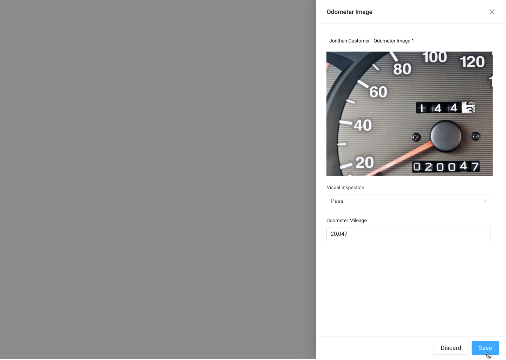

# Odometer Image Drawer



### Usage



### Requirements

* If 



### States

### Direct Lease Documents

### Upload Drawer

{% embed url="https://www.figma.com/file/w78ZiMR2USgl1CwXVrcxXv/?node-id=2699%3A31813" %}

#### Odometer Pass

**Fail Mileage**

### Fail Bad Image

### Complete

{% embed url="https://www.figma.com/file/w78ZiMR2USgl1CwXVrcxXv/?node-id=876%3A26057" %}

### Edit

{% embed url="https://www.figma.com/file/w78ZiMR2USgl1CwXVrcxXv/?node-id=1971%3A15898" %}

### Update

{% embed url="https://www.figma.com/file/w78ZiMR2USgl1CwXVrcxXv/?node-id=2699%3A31813" %}



### Error Handeling

{% embed url="https://www.figma.com/file/w78ZiMR2USgl1CwXVrcxXv/?node-id=1119%3A26459" %}



