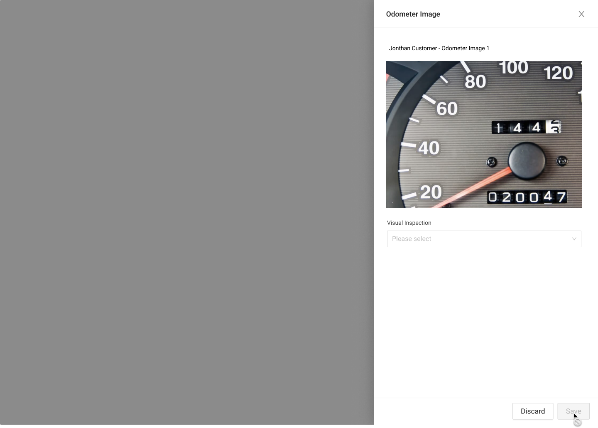
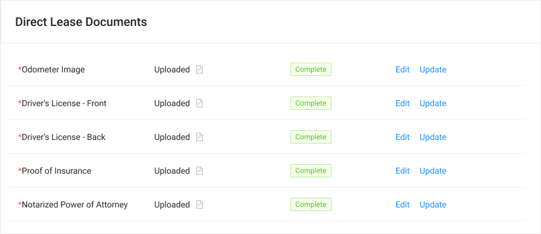

# Odometer Image Drawer



### Usage



### Requirements

* If 



### Steps

#### Direct Lease Documents - Member Clicks Upload

#### Upload Side Drawer

#### Upload Images

#### Upload Complete

#### Odometer Sidedrawer OnLoad

#### Odometer Pass

**Pass - Mileage Input Error Messaging**

#### Fail - Bad Image

#### Final State 




### Error Handeling

{% embed url="https://www.figma.com/file/w78ZiMR2USgl1CwXVrcxXv/?node-id=1119%3A26459" %}



