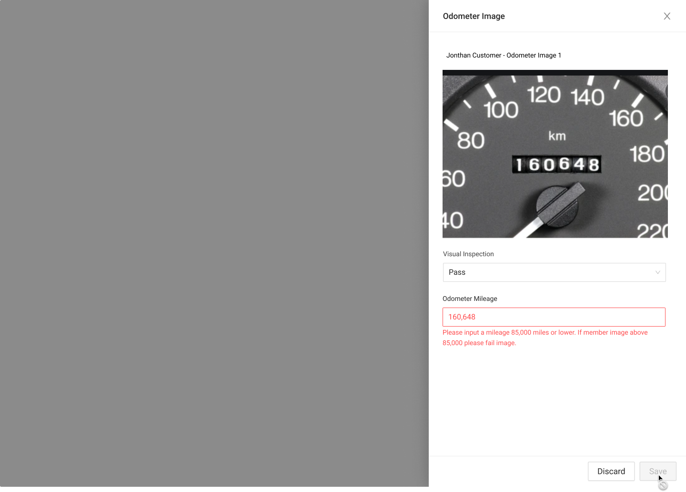
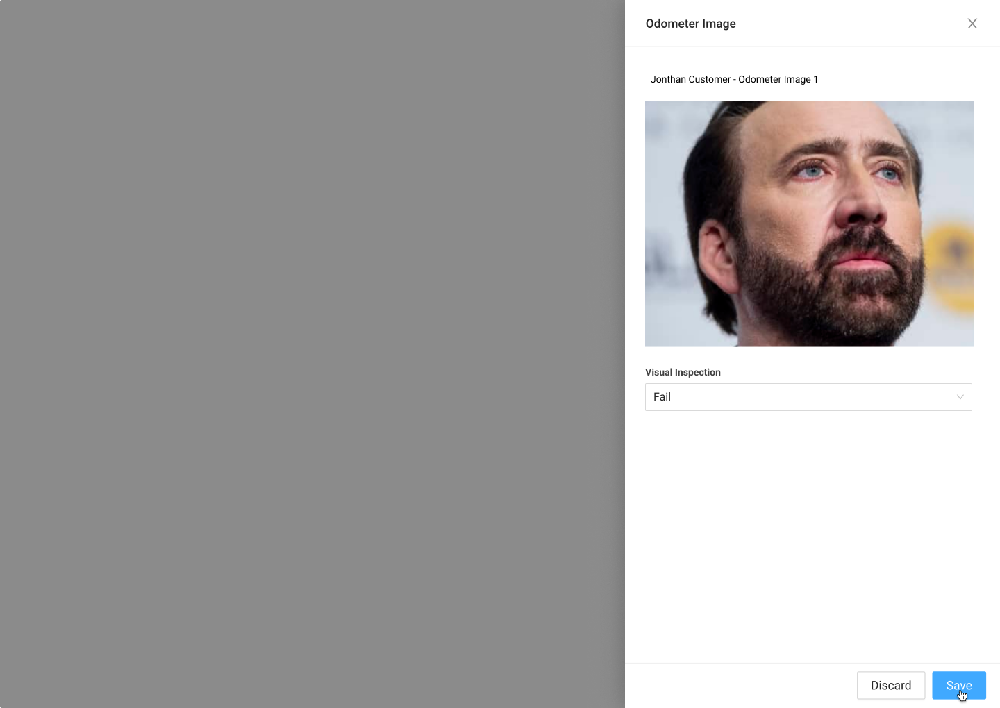

# Odometer Image Drawer



### Usage

This drawer is used by MSAs to verify the Odometer value of a vehicle. Data entered into this drawer is used to run the valuation for the final statement of advance.



### Requirements

* The MSA must be able to mark the image pass/fail to Save
* If the image passes the visual inspection, the MSA must be able to enter in the odometer reading from the image. 
  * If the odometer reading is over 85,000 miles, then the MSA should mark the image as failed and an error state is shown.
* The Odometer Input is passed towards the Final Advance Valuation. 



### Steps

#### Step 1: Direct Lease Documents - Member Clicks Upload

#### Step 2: Upload Side Drawer

#### Step 3: Upload Images

#### Step 4: Upload Complete

#### Step 5: Odometer Sidedrawer OnLoad \(actual component\)

#### State: Pass

**State Pass - Mileage Input Error Messaging**

#### State: Fail - Bad Image

#### Step 6: Task Complete




### Visual Inspection

* If the MSA selects Pass on the Visual Inspection dropdown, the Odometer Reading field should appear.
* If the MSA selects Fail on the Visual Inspection dropdown, the Save button should be activated. If the Odometer Reading is visible, changing the Inspection to Fail should hide the Odometer Reading.

### Odometer Reading

* If the Odometer reading is greater than 85,000 miles, an error should appear, instructing the user to change the Visual Inspection to Fail.
* If a valid Odometer reading is entered, the Save button should be made accessible.

### Save Button

* If the Save button is active and clicked:
  * If Visual inspection is Pass, then the document should be marked as verified. The Asset's stored odometer value should be updated with the entered Odometer reading and a valuation should be run with the odometer reading given. The value should be saved as the final valuation, and the sidebar should be updated with this value as the current valuation and the final valuation. The drawer should then close.
  * If Visual inspection is Fail, then the document should be marked as failed, and the drawer should close.
* If the Save button is inactive \(default state\):
  * Nothing should happen if the button is clicked.

### Discard and Close Buttons:

* If Discard or Close is clicked, the drawer should close, and any entered values should be discarded.



### Error Handeling

{% embed url="https://www.figma.com/file/w78ZiMR2USgl1CwXVrcxXv/?node-id=1119%3A26459" %}



