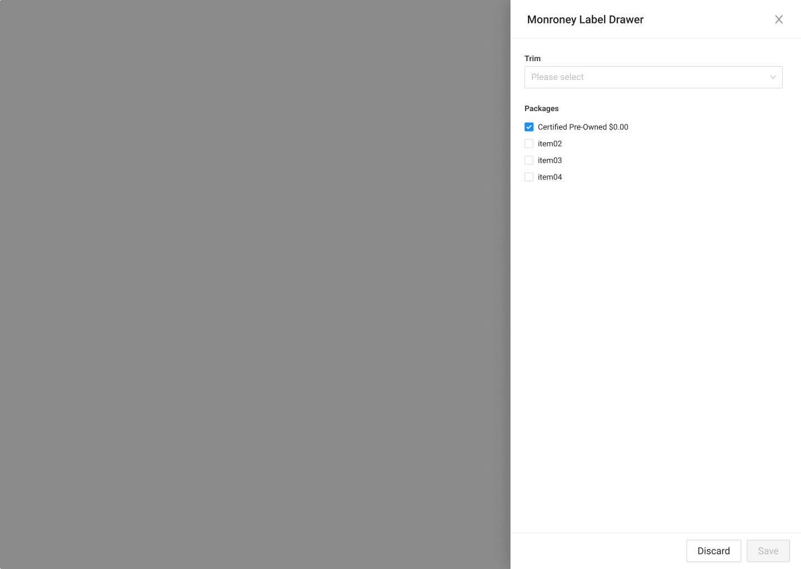

# Monroney Label Drawer

{% embed url="https://www.figma.com/file/w78ZiMR2USgl1CwXVrcxXv/?node-id=1149%3A28082" %}



### Usage

This drawer is used to verify trims and packages for a vehicle, and triggers the preliminary valuation. It's named the Monroney Label drawer because the MSA uses the Monroney Label to check these.



### Requirements

* The available trims for a vehicle should be listed in a dropdown, with a null state as default if no trim has been previously selected
* Available Packages should be listed as checkboxes, and multiple can be selected
* A valuation should be run if the values are changed and the user clicks "Save".
* Any changes should be discarded if the user clicks Discard or the Close button.



## States

### Trim Task Table

{% embed url="https://www.figma.com/file/w78ZiMR2USgl1CwXVrcxXv/?node-id=851%3A25917" %}

### Upload Maroney Image

#### Maroney Label Drawer OnLoad

#### Maroney Label Complete

#### Final Trim Table

{% embed url="https://www.figma.com/file/w78ZiMR2USgl1CwXVrcxXv/?node-id=876%3A25901" %}

### Edit




### Save button

* Should be grayed out if the trim is null or if no changes have been made.
* When clicked, a Valuation should be run, the database should be updated with this valuation as the preliminary valuation, and both the Current Valuation and Preliminary Valuation should be updated in the Sidebar.
* The Transaction numbers should also be recalculated and shown in the sidebar/saved in the database.

### Discard button

* Always available/clickable
* Should discard any input values and close the drawer, with no modifications made.
* Functionally Identical to the Close button.

### Close button

* Always available/clickable
* Should discard any input values and close the drawer, with no modifications made.
* Functionally Identical to the Discard button



### Error Handeling

{% embed url="https://www.figma.com/file/w78ZiMR2USgl1CwXVrcxXv/?node-id=1119%3A26459" %}



### 



