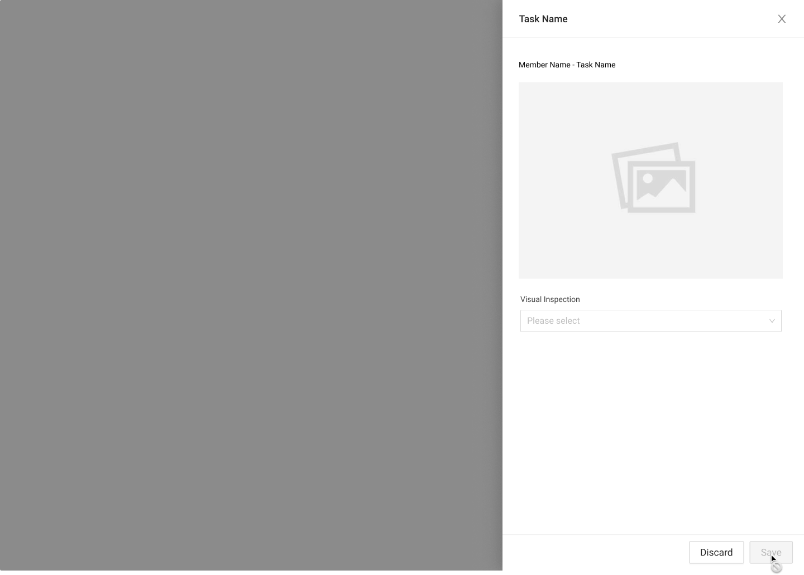
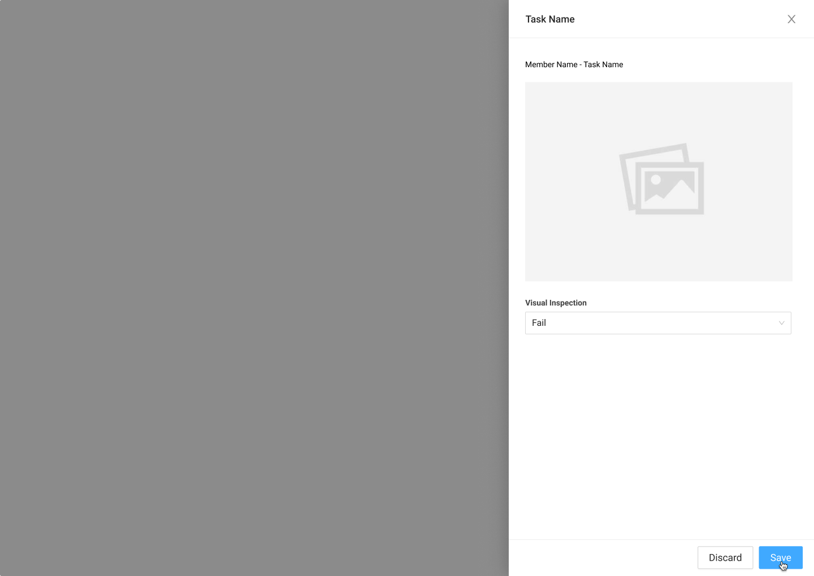

# Upload/Verify Drawer

{% embed url="https://www.figma.com/file/w78ZiMR2USgl1CwXVrcxXv/?node-id=1149%3A37201" %}



### Usage

This component is used by MSAs to upload documents and verify existing documents.



### Components with Interactions:





### Requirement

* The MSA should be able to upload an image.
  * Files that are not images or PDFs are not accepted.
  * Files over 5MB aren’t supported
* If a file already exists, then it will be archived/hidden, and the new file will take its place as the type of document selected.
* Upon an upload being initiated, the file should be validated.
* The upload drawer can only accept one file at a time
* The Save button should be inactive by default.
* The MSA should be able to view the uploaded image
* The MSA must be able to mark the image as pass or fail for verification purposes. The Save button should only be activated once pass or fail has been selected.
* If the user clicks save, the uploaded file should be stored as the document type that it was uploaded for, and any existing files should be archived and hidden. The Verification status should be updated to match the image status given.
* If discard or close is clicked, any uploads or verification changes should be discarded.



1. The drawer is opened
2. A file is uploaded to the drawer
3. The file is displayed in the drawer
4. The verification status of the document is marked \(pass/fail\)
5. The upload and verification status are saved.



### Onload Task Table

{% embed url="https://www.figma.com/file/w78ZiMR2USgl1CwXVrcxXv/?node-id=718%3A25252" %}

#### Upload

#### Upload Complete, MSA saves Image

#### Upload/Verify Side Drawer Appears OnLoad

#### Pass

#### Fail

### Complete

{% embed url="https://www.figma.com/file/w78ZiMR2USgl1CwXVrcxXv/?node-id=2699%3A32068" %}



### Interactions

**Upload Component**

* If a valid file has already been uploaded, it should be displayed.
* The upload component should accept uploads either from the system file picker or from drag/drop.
  * If the user clicks the upload component, the system file picker should appear. Once a file is selected, an upload should be initiated with the selected file.
  * If the user drags a file to the upload component, an upload should be initiated with the selected file.
* Upon an upload being initiated, the file should be validated.
  * File must be an image/PDF\(?\) and under XMB.
* Once a successful upload is performed, the image should be displayed in the drawer, replacing any existing images if present.
* If the user uploads a file when another file was already uploaded, the old upload should be discarded and the new upload should replace the existing upload upon save.
  * The upload drawer can only accept one file at a time.

**Visual Inspection**

* If the Visual Inspection dropdown is null, the Save button should be inactive.
* If the MSA selects Pass or Fail on the Visual Inspection dropdown, the Save button should be activated.

**Save Button**

* The Save button's default state is inactive.
  * If it is clicked while inactive, nothing should happen.
* If the Save Button is clicked while active, the associated document should be updated with the appropriate status, any existing documents should be hidden/archived, the new document should replace the old document for the selected document type, and the drawer should close.
  * Verified if the Visual Inspection is Pass
  * Failed if the Visual Inspection is Fail

**Discard and Close Buttons**

* The Discard button should always be active. When clicked, it should discard any uploads or input received, and the drawer should close.
  * The close button behaves identically.



1. If file validation fails, then an error should appear.
2. If file validation passes, the upload should begin. A progress bar should be shown with the upload.



### Tasks that use this Drawer Component

| Name | Task Table |
| :--- | :--- |
| Driver's License Front | [Direct Lease Documents](../task-tables/task-table/direct-lease-documents.md) |
| Driver's License Back | [Direct Lease Documents](../task-tables/task-table/direct-lease-documents.md) |
| Proof of Insurance | [Direct Lease Documents](../task-tables/task-table/direct-lease-documents.md) |
| Notarized Attorney | [Direct Lease Documents](../task-tables/task-table/direct-lease-documents.md) |
| Bill of Sale | [Disbursement](../task-tables/task-table/disbursement.md) |
| Title Application | [Disbursement](../task-tables/task-table/disbursement.md) |
| Insurance Coverage Verification | [Disbursement](../task-tables/task-table/disbursement.md) |
| Insurance Loss Payee Verification | [Disbursement](../task-tables/task-table/disbursement.md) |
| Engagement Letter | [Disbursement](../task-tables/task-table/disbursement.md) |

