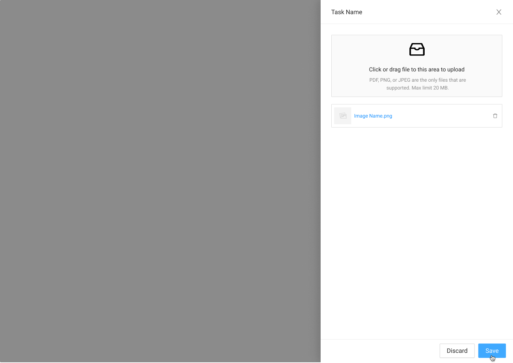

# Upload/Verify Drawer

{% embed url="https://www.figma.com/file/w78ZiMR2USgl1CwXVrcxXv/?node-id=1149%3A37201" %}



### Usage



### Requirement

* When user saves Pass. Task Table Tag becomes Complete.
* When user select Fail. Task Table Tag becomes Fail.
* Update overides the saved photo \(for this version\).
* 



### Onload Task Table

{% embed url="https://www.figma.com/file/w78ZiMR2USgl1CwXVrcxXv/?node-id=718%3A25252" %}

#### Upload

#### Upload Complete, MSA saves Image

#### Upload/Verify Side Drawer Appears OnLoad

#### Pass

#### Fail

### Complete

{% embed url="https://www.figma.com/file/w78ZiMR2USgl1CwXVrcxXv/?node-id=2699%3A32068" %}



### Interactions



### Tasks that use this Drawer Component

| Name | Task Table |
| :--- | :--- |
| Driver's License Front | [Direct Lease Documents](../task-tables/task-table/direct-lease-documents.md) |
| Driver's License Back | [Direct Lease Documents](../task-tables/task-table/direct-lease-documents.md) |
| Proof of Insurance | [Direct Lease Documents](../task-tables/task-table/direct-lease-documents.md) |
| Notarized Attorney | [Direct Lease Documents](../task-tables/task-table/direct-lease-documents.md) |
| Bill of Sale | [Disbursement](../task-tables/task-table/disbursement.md) |
| Title Application | [Disbursement](../task-tables/task-table/disbursement.md) |
| Insurance Coverage Verification | [Disbursement](../task-tables/task-table/disbursement.md) |
| Insurance Loss Payee Verification | [Disbursement](../task-tables/task-table/disbursement.md) |
| Engagement Letter | [Disbursement](../task-tables/task-table/disbursement.md) |

