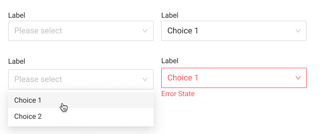

# Dropdown with Label



### Usage

The `Dropdown with Label` displays and allows users to select a single item from a predetermined list. When the trigger is clicked, a dropdown menu will appear, which allows the user to select a single item from the list.



### Parent Object

[Ant Design's Select](https://ant.design/components/select/)



### Requirments

* The component must have borders and must use a downwards arrow as the dropdown icon
* This component should not support groupings or multiple selections, child components should be made for specific use cases if these are needed.
* The component should load into the previously selected object if data is present.
*  If no data is present, "Please select" should appear as hint text
* If the component is marked required on the form, and no value is selected, an Error should appear



### Code





