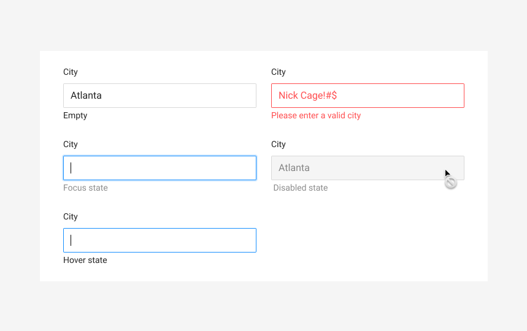

# City



**Usage**

An input field with validation for city names



**Parent Object**

[Ant Design's Input Link](https://ant.design/components/input/)



**Requirements**

* Only accepts letters and symbols
* Max character limit is 32
* Unicode symbols are allowed, to cover Spanish, Hawaiian, or Native American city names



**Validation**

\*\*\*\*



**Attributes Format**

\*\*\*\*



**Error Handling**

Please provide a valid city



#### Code



