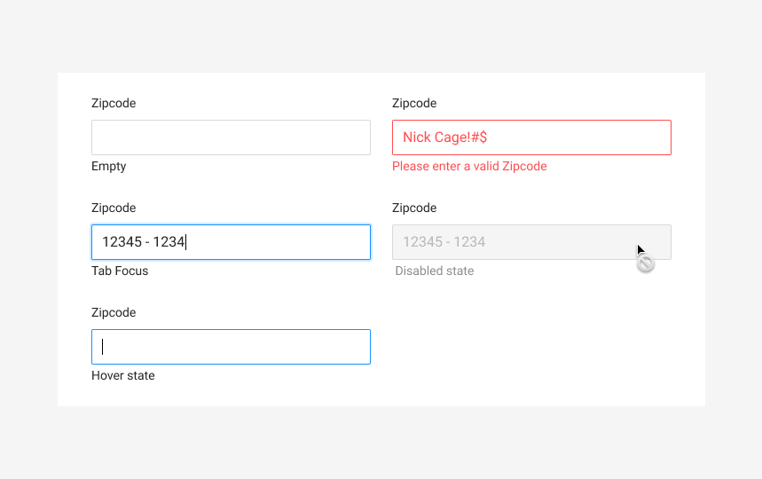

# Zipcode





**Usage**

This field accepts zipcodes as parts of a users address



**Parent Object**

[Ant Design's Input](https://ant.design/components/input/)



**Requirements**

* Accepts digits only
* Accepts 5 characters
* Accepts additional 4 characters with formatting 12345-1234
* Leading Zeroes must be supported.
* Input can be type OR pasted
* Non-existing 5 digits Zip results in error messaging
  * Zipcodes must be either 5 or 5+4 digits. If the field is blank, or if either less than 5 or less than 9 digits are entered, an error should appear.



**Attributes Format**

```text
12345=>12345
12345-1234=>12351234
```



**Error Handeling**

* Please enter a valid zipcode



**Code**



\*\*\*\*

