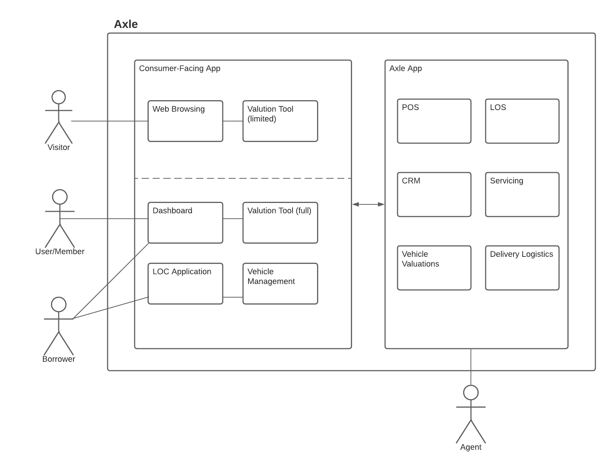

# System Architecture

## What is Axle?

Axle is an end-to-end digital lending platform that streamlines income/asset/employment verifications and provides near real-time approvals for lines of credit, including all the integrations necessary for efficient and accurate credit decisioning.

Axle will support multi-tenancy, to open the possibility of becoming a SaaS product in the future.

There are several key components needed to make this possible.

* **Point of sale**
  * Easily guide customers through the auto loan process with an intuitive user experience and responsive design
  * Live screen sharing to assist borrowers at any point in the application process, via FullStory integration
* **Loan origination**
  * Seamless data collection
  * Income and employment verification
  * Real-time decisions and stipulation requests. Automatically detect and surface issues at the time of application, by analyzing borrower data and documents in real time.
* **Vehicle asset management**
  * License plate lookup and VIN decoding
  * Vehicle lifetime valuations
* **Customer relationship management**
  * Easily manage loan documents, interact with borrowers and track communications
  * Task automation
* **Servicing**
  * Loan servicing, payment processing, and automated compliance provided via Peach integration

## State & Status

Reference page: [https://carputty.atlassian.net/l/c/0Lcuwb8b](https://carputty.atlassian.net/l/c/0Lcuwb8b)

### Application Statuses 

* `pending` - Default status for new LOC applications. Identity, credit and income information still missing.
* `underwriting` - All required fields are captured. This step is typically performed by the automated decision engine, but can be done manually as well.
* `needs-review` - The application requires manual review, for any special cases that fall through the decision engine.
* `canceled` - The application was canceled by the member.
* `declined` - The application was denied.
* `approved` - The application was approved
* `originated` - The borrower signed the LOC agreement document, and passed a hard credit pull.

### Asset/Transaction Statuses 

* `pending` - The transaction has been initiated, but no information has been submitted
* `prelim-advance-waiting` - The information for a preliminary statement has been submitted and needs to be reviewed by us
* `prelim-advance-review` - The preliminary statement must be reviewed and signed by the member
* `documents-upload` - Documents required for the final statement must be uploaded by the member
* `final-advance-waiting` - The information for a final statement has been submitted and needs to be reviewed by us
* `final-advance-review` - The preliminary statement must be reviewed and signed by the member
* `approved` - The transaction has been approved
* `vehicle-pickup-confirmation` - For Retail transactions - the member must confirm that their vehicle has been picked up
* `ready-to-fund` - The transaction is ready to fund.
* `funding-requested` - Funding for the asset/transaction is in-process
* `funded` - The asset/transaction has been funded.

## Terms

| People & Roles | Description |
| :--- | :--- |
| MSA | Member Success Agents |
| Agent | Any person with account access to Axle. \(non-customer facing\) |
| Borrower | Any person who initiated the loan application process. |
| Visitor | Any person who visits the website, and has not created an account yet. |

| Term | Description |
| :--- | :--- |
| LOS | Loan Origination System |
| Refi | Car refinancing a traditional loan |
| User/Member | Any person who signed up for a Carputty account. |
| Application | A line of credit application. |
| Loan | A line of credit created after the application is originated. |
| Asset | A vehicle that's been successfully added to a carputty line of credit. |
| Transaction | A vehicle this is actively being processed to a carputty line of credit. |
| Loan Origination System \(LOS\) | A process by which a borrower applies for a new loan, and a lender processes that application. |
| Manheim Market Report \(MMR\) | A third-party data provider of wholesale vehicle valuations. Also sources vehicle aspects data \(year/make/model/trims\). |

