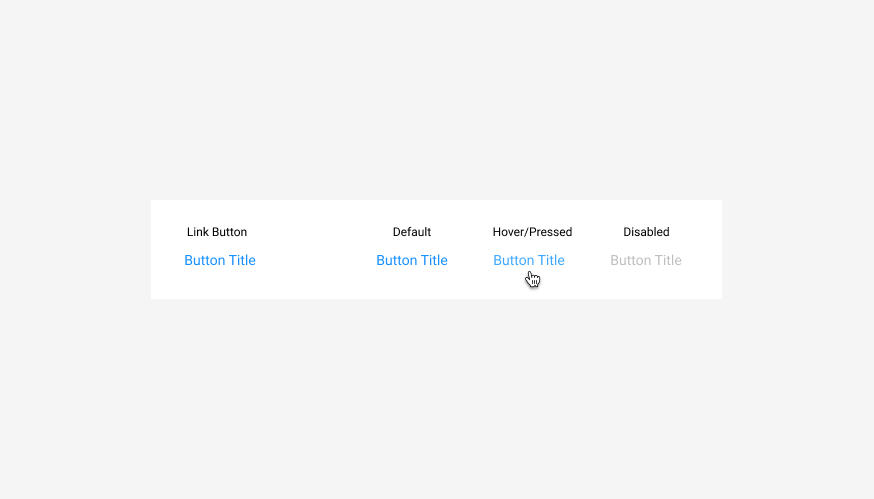

# Link Button



### **Usage**

* [Link button](link-button.md) \(tertiary button\): used for external links or could be used where you want to enable a user to take an action that is not valuable to most users.



### Parent Object





### Requirements

* Contains default, hover, and disabled
* Base styling



### Code



\*\*\*\*

\*\*\*\*

