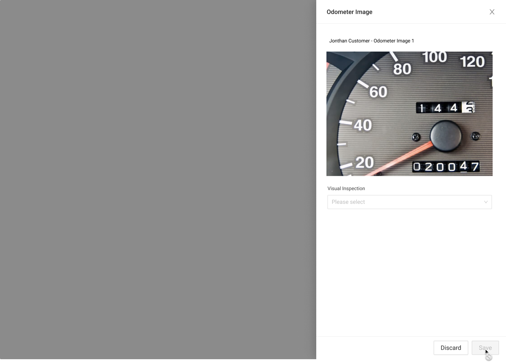
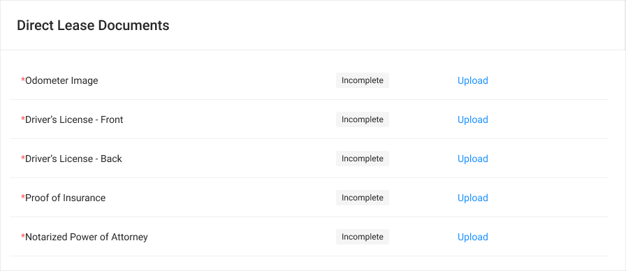
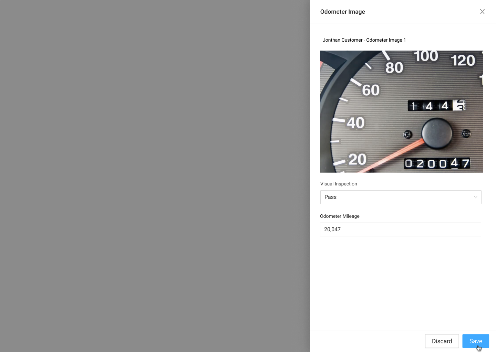
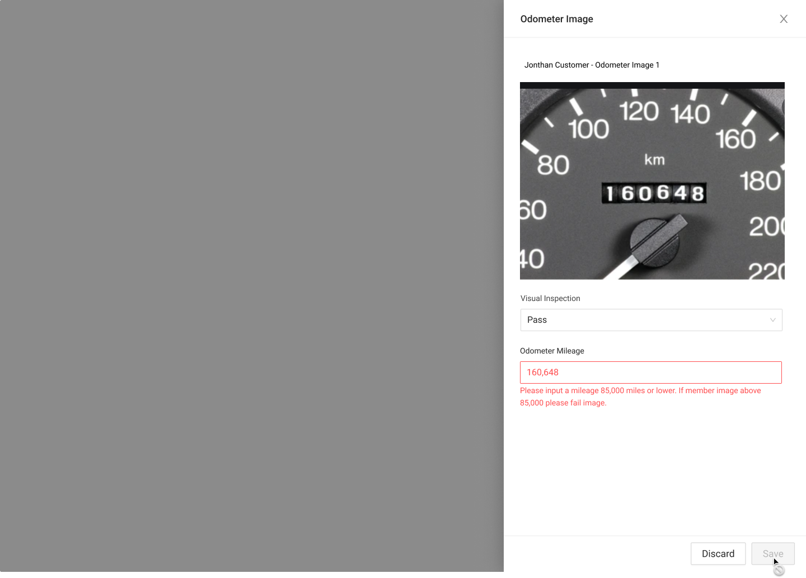
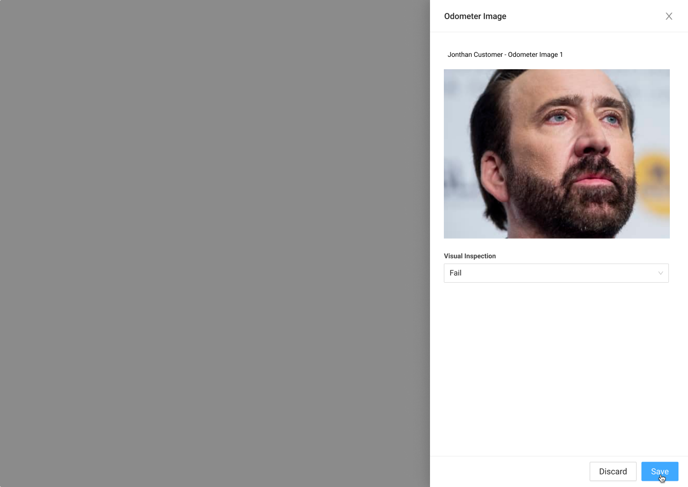
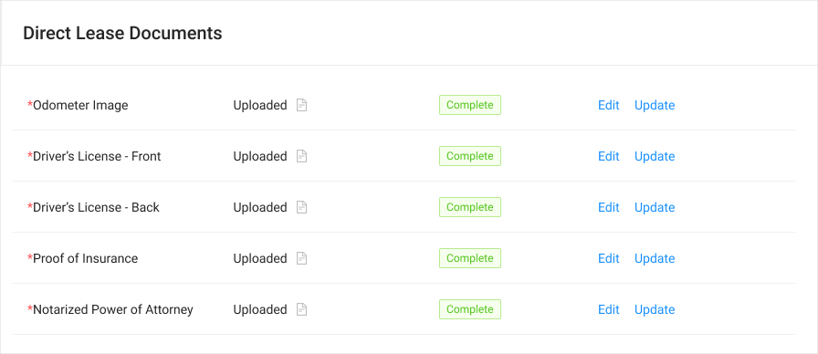

# Odometer Image Drawer



### Usage

This drawer is used by MSAs to verify the Odometer value of a vehicle. Data entered into this drawer is used to run the valuation for the final statement of advance.

Components included:







### Requirements:

* The MSA must be able to mark the image pass/fail to Save
* If the image passes the visual inspection, the MSA must be able to enter in the odometer reading from the image. 
  * If the odometer reading is over 85,000 miles error state is shown.
* The Odometer Input is passed towards the Final Advance Valuation. 

### Steps:

IF image does NOT exist

1.  ****Documents - MSA Clicks Upload
2. Upload side drawer is open and image is empty
3. MSA can drag and drop or click upload button to upload image
4. Once image is uploaded, verification drop down is active
5. IF image passes THEN MSA will mark as passed
6. IF image fails THEN MSA will mark as fail
7. IF image passes then odometer reading field will appear
8. MSA can enter numbers into odometer reading
9. IF odometer reading is over 85,000 miles THEN error alert will show
10. MSA can hit save to save document
11. Documents shows as uploaded and complete

IF image does exist

1.  ****Documents - MSA Clicks Upload
2. Upload side drawer is open and image is shown
3. IF MSA needs to replace image THEN they  click upload button to upload image
4. IF image is in place verification drop down is active
5. IF image passes THEN MSA will mark as passed
6. IF image fails THEN MSA will mark as fail
7. IF image passes then odometer reading field will appear
8. MSA can enter numbers into odometer reading
9. IF odometer reading is over 85,000 miles THEN error alert will show
10. MSA can hit save to save document
11. Documents shows as uploaded and complete

### UI Interactions

#### Visual Inspection

* If the MSA selects Pass on the Visual Inspection dropdown, the Odometer Reading field should appear.
* If the MSA selects Fail on the Visual Inspection dropdown, the Save button should be activated. If the Odometer Reading is visible, changing the Inspection to Fail should hide the Odometer Reading.

#### Odometer Reading

* If the Odometer reading is greater than 85,000 miles, an error should appear, instructing the user to change the Visual Inspection to Fail.
* If a valid Odometer reading is entered, the Save button should be made accessible.

#### Save Button

* If the Save button is active and clicked:
  * If Visual inspection is Pass, then the document should be marked as verified. The Asset's stored odometer value should be updated with the entered Odometer reading and a valuation should be run with the odometer reading given. The value should be saved as the final valuation, and the sidebar should be updated with this value as the current valuation and the final valuation. The drawer should then close.
  * If Visual inspection is Fail, then the document should be marked as failed, and the drawer should close.
* If the Save button is inactive \(default state\):
  * Nothing should happen if the button is clicked.

#### Discard and Close Buttons:

* If Discard or Close is clicked, the drawer should close, and any entered values should be discarded.



Error message \(onUpload\)

* IF image is not valid image type then error is shown:
  * Invalid File Type
* IF image is too large then error is shown:
  * File is over 10MB

Error message \(onEntry\)

* IF odometer entered is higher than 85,000 then error is shown:
  * "Vehicles with over 85,000 miles are not supported. If the vehicle has over 85,000 miles, mark the Visual Inspection as Failed."



### Steps

#### Documents - MSA Clicks Upload

#### Upload Side Drawer

#### Upload Complete

#### State: Pass

**State Pass - Mileage Input Error Messaging**

#### Fail - Bad Image

#### Task Complete




### 



