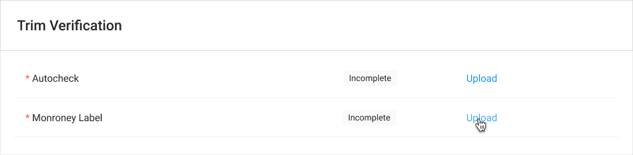
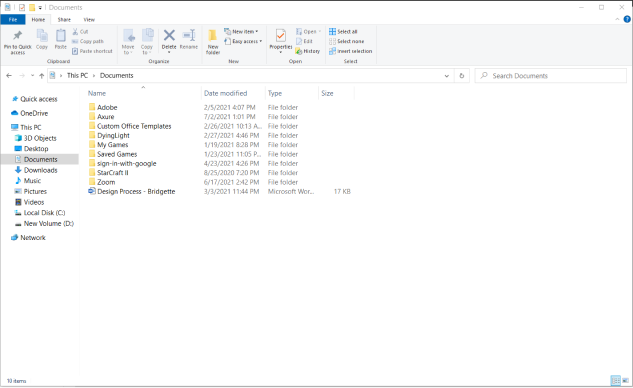

# Monroney Label Drawer



### Usage

This drawer is used to verify trims and packages for a vehicle, and triggers the preliminary valuation. It's named the Monroney Label drawer because the MSA uses the Monroney Label to check these.

Components with Interactions: 



Tasks that use this Drawer Component:

| Name | Task Table |
| :--- | :--- |
| Monroney Label | [Trim](../table-receipe/task-table-templates/trim.md) |



### Requirements

* The MSA should be able to upload an image.
* Files that are not PDF, JPG, TIFF, PNG, or GIF are not supported.
  * Files over 10MB aren’t supported
* If an image has already been uploaded, and a new image is uploaded to replace it, the old image should be archived/hidden, and the new image will replace the old given the type of document selected.
* Upon an upload being initiated, the file should be validated.
* The upload drawer can only accept one file at a time
* The Save button should be inactive by default.
* The MSA should be able to view the uploaded image.
* The Trim dropdown should have a null state by default, if no trim has been selected.
* The Save button should only be activated once a trim has been selected.
* Available Packages should be listed as checkboxes, and multiple can be selected. It should be possible to save the document and generate the valuation even if no boxes are selected.
* If the user clicks save, the uploaded file should be stored as the Monroney label. If an image was already submitted for this document type, it should be archived and hidden. The document should be marked as verified if a trim has been selected. Finally, a valuation should be run, and saved to the database as the prelim valuation, as well as the current valuation. The sidebar should be updated when this occurs.
* If discard or close is clicked, any uploads or verification changes should be discarded.

### **Steps:**

1. The drawer is opened
2. A file is uploaded to the drawer
3. The file is displayed in the drawer
4. A trim and options are selected
5. The upload and verification status are saved, a valuation is run, the current value of the car is updated, the prelim valuation is updated, and the sidebar shows these changes.

### UI Interactions

**Upload Component**

* If a valid file has already been uploaded, it should be displayed.
* The upload component should accept uploads either from the system file picker or from drag/drop.
  * If the user clicks the upload component, the system file picker should appear. Once a file is selected, an upload should be initiated with the selected file.
  * If the user drags a file to the upload component, an upload should be initiated with the selected file.
* Upon an upload being initiated, the file should be validated.
  * File must be PDF, JPG, TIFF, PNG, or GIF and under 10MB.
* Once a successful upload is performed, the image should be displayed in the drawer, replacing any existing images if present.
* If the user uploads a file when another file was already uploaded, the old upload should be discarded and the new upload should replace the existing upload upon save.
  * The upload drawer can only accept one file at a time.

**Trim**

* If the Trim dropdown is null, the Save button should be inactive.
* If the MSA selects a value for Trim, the Save button should be activated.

**Save Button**

* The Save button's default state is inactive.
  * If it is clicked while inactive, nothing should happen.
* If the Save Button is clicked while active, the associated document should be updated with the appropriate status, the previously uploaded image \(if applicable\) should be hidden/archived, the new document should replace the old Monroney Label document, the prelim valuation should be run and saved as the prelim valuation and current value, the sidebar should be updated, and the drawer should close.

  * Verified if the Trim is not null.

**Discard and Close Buttons**

* The Discard button should always be active. When clicked, it should discard any uploads or input received, and the drawer should close.
  * The close button behaves identically.

### 



### Error Handling

Error message \(onUpload\)

* IF image is not valid image type then error is shown:
  * Invalid File Type
* IF image is too large then error is shown:
  * File is over 10MB

If file validation passes, the upload should begin. A progress bar should be shown with the upload.



### Onload - Trim Table

### Upload Drawer - OnLoad

### Select File

### Select Trim

### Trim Table Status Changes to Complete

### Edit/Update




### 



