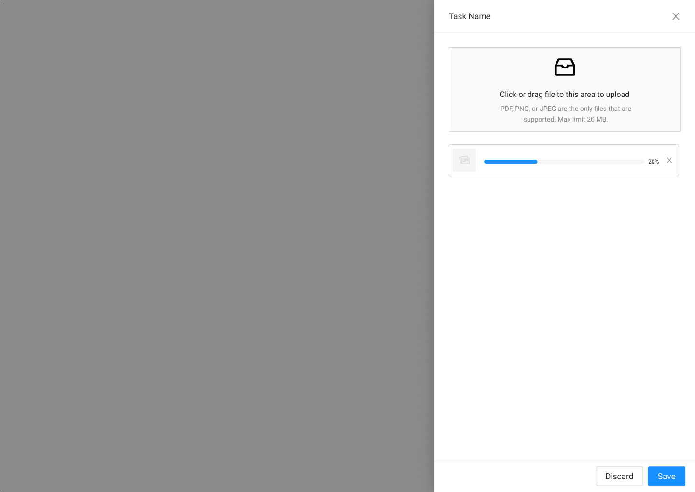

# Upload Drawer Recipe



The upload drawer is used to simply upload documents. There are different states as the object is being loaded to Axle.



### Parent Object

#### Upload



**Right Drawer**





### Requirements

* When object are dragged in they are uploaded
* If an object is already uploaded. Replace the current image with the new one.



### States & Steps

#### Upload Drawer OnLoad

#### Hover

#### Loading

### Complete

#### Error State




### Uploaded Error

{% embed url="https://www.figma.com/file/w78ZiMR2USgl1CwXVrcxXv/?node-id=1119%3A26459" %}



