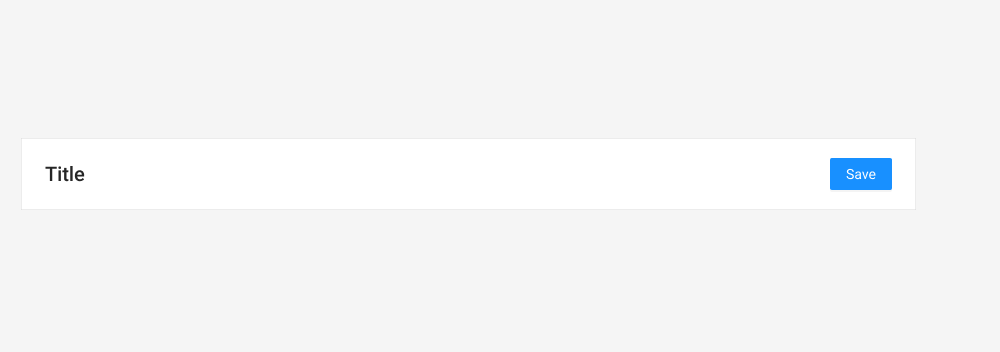
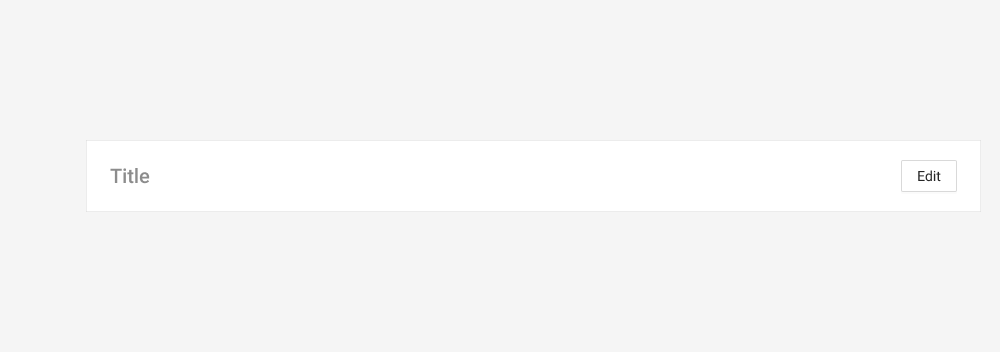

# Save/Edit Form Header Recipe



The save/edit form has different states to allow for the rest of the form to save and edit for a submission.



### Parent Object





* has 3 states in which the Title and buttons change based on user input



### States

### On-Load

### Edit 

### Save/Discard








