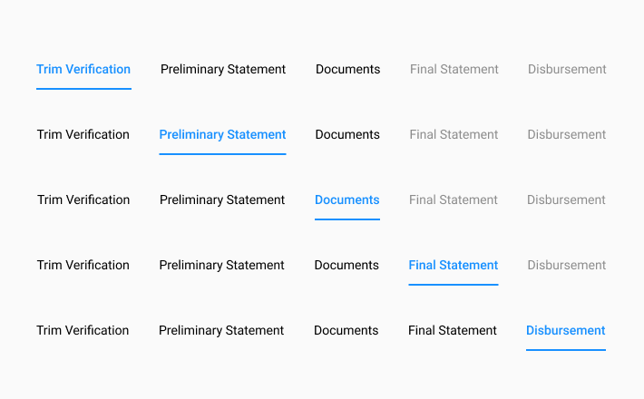

# LBO Nav Menu

### 



















### 1. **Description**

The top-level navigation acts as a way for the [MSA](/@carputty/s/axle-doc/~/drafts/-Mj6PiC0RODKAHAW-Crz/) to progress through the flow while accessing different components. On load, Trim, Preliminary, and Documents are available to switch between.

**Parent Object**  
[Ant Design's Menu - Top Navigation ](https://ant.design/components/menu/)

### **Functional Requirements**

**Final Statement** is reached when the required Preliminary & Documents fields are filled, saved and preliminary generated.

**Disbursement** is reached when the required Preliminary, Documents, and Final State fields are filled, saved, and final statement generated.

### 2. On-Load 

{% embed url="https://www.figma.com/file/w78ZiMR2USgl1CwXVrcxXv/?node-id=152%3A6078" %}

