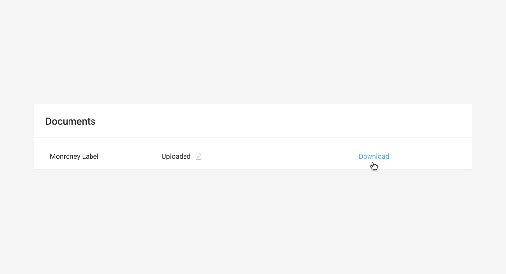
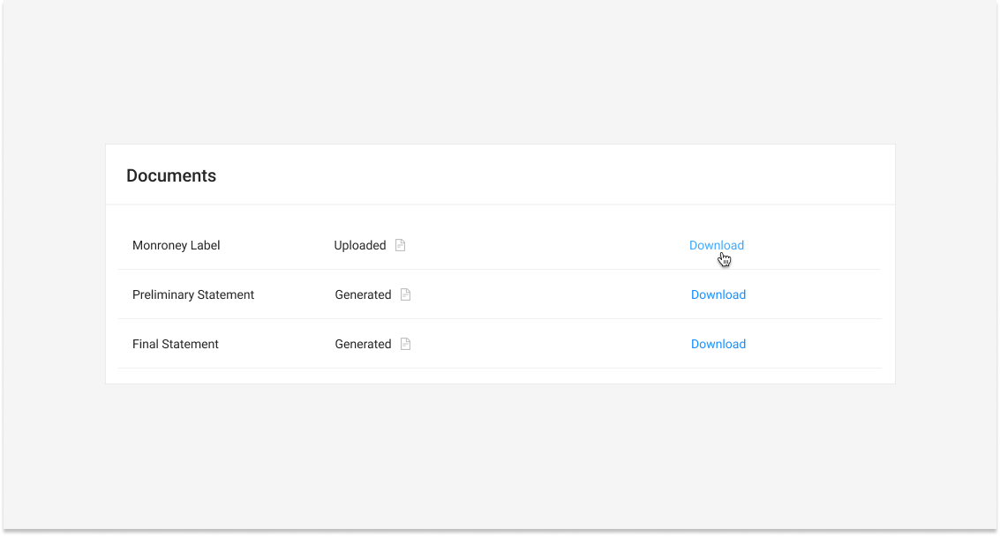

# Document Table



The Document Table serves as a centralized repository for all documents uploaded as a part of the transaction.



### Requirements

* All documents uploaded as a part of the transaction should be present in the table.
* The Document Type, status, and a Download link for each document should appear for each document in the table



### On-load

### Final




### For each Item:

* When Download is clicked, the document associated with the table item will be downloaded.







