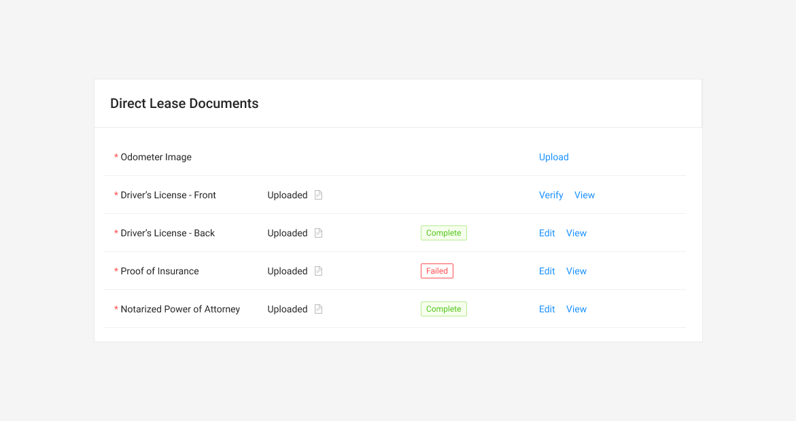

# Direct Lease Documents



### Usage

The Direct Lease Documents table tracks the documents and verification for a Direct lease buyout transaction.

### Base Component





#### Fields

Fields marked as Required must be completed and validated to submit the form attached to this table.

| Name | Drawer Type | Required |
| :--- | :--- | :--- |
| Odometer Image | Odometer | **Yes** |
| Driver's License - Front | Upload/Verify | **Yes** |
| Driver's License - Back | Upload/Verify | **Yes** |
| Proof of Insurance | Upload/Verify | **Yes** |
| Notarized Power of Attorney | Upload/Verify | **NO** - but a red asterisk should still appear.  |

### Interactions

See [Task Table](../../../ingredients/task-tables/task-table.md).



### See [Task Table](../../../ingredients/task-tables/task-table.md)



### On-Loading

### Status Change when tasks are complete

### Complete








