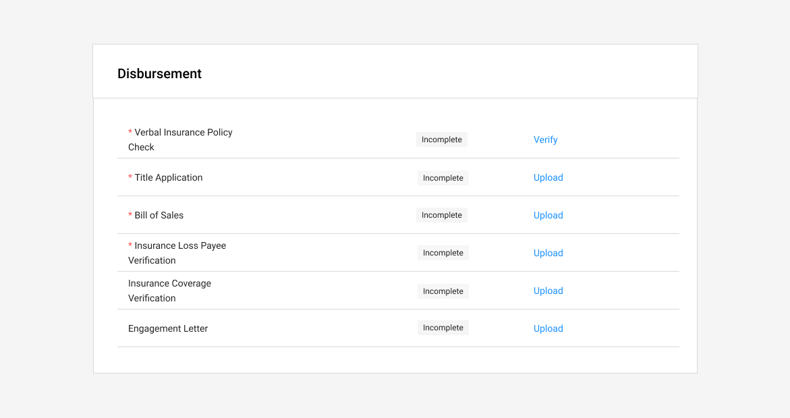
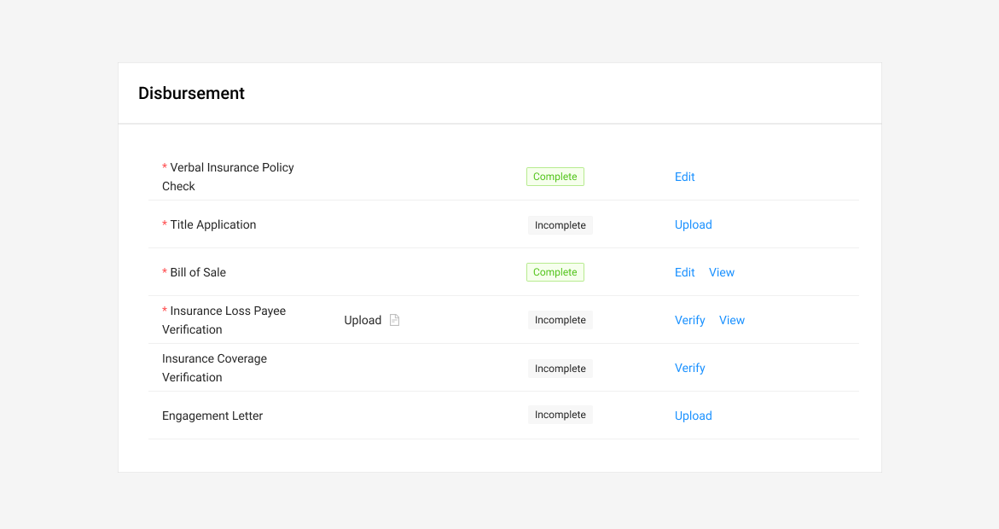
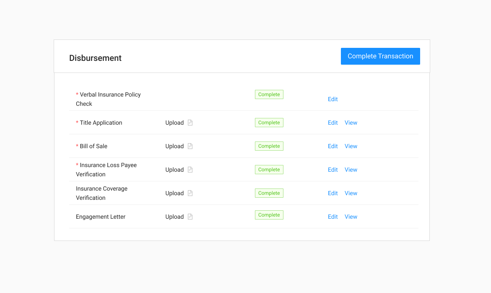

# Disbursement Table



### Usage

Disbursement is the final section for the lease-buyout flow and signfies to OPS that the application is done. 

### Base Component





### Fields

| Name | Drawer Type | Required |
| :--- | :--- | :--- |
| Verbal Insurance Policy Check | Verification | Yes |
| Title Application | Upload/Verify | Yes |
| Bill of Sale | Upload/Verify | Yes |
| Insurance Loss Payee Verification | Upload/Verify | Yes |
| Insurance Coverage Verification | Upload/Verify | No |
| Engagement Letter | Upload/Verify | No |

### Interactions

* The Finish Transaction button should be hidden until all required tasks are completed.
* The Finish Transaction button marks the Asset record status as Ready To Fund.
  * An email is sent to Operations indicating that the vehicle is ready to fund.
  * Another email is sent to the member with an update on their loan status.
* All other Interactions are inherited from the [Task Table component](../../../ingredients/task-tables/task-table.md).



See [Task Table](../../../ingredients/task-tables/task-table.md)



### States

### On-loading

### Status Changes

### Completed 








