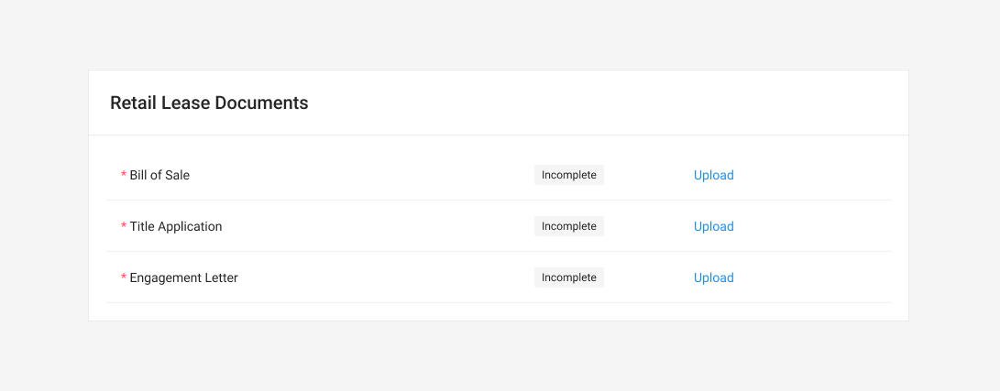
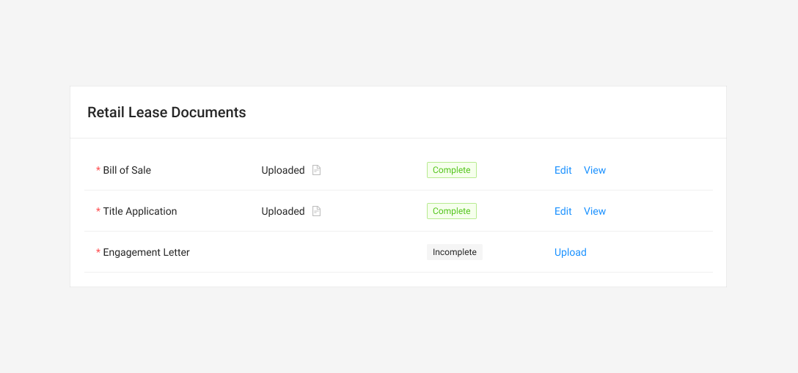
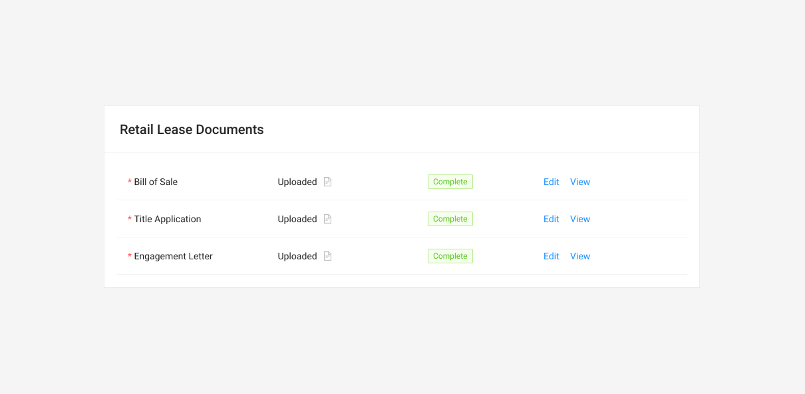

# Retail Lease Documents Table



### Usage

The Retail Lease Documents table tracks the documents and verification for a Direct lease buyout transaction.

### Base Component





### Fields

Fields marked as Required must be completed and validated to submit the form attached to this table.

| Name | Drawer Type | Required |
| :--- | :--- | :--- |
| Bill of Sale | Upload/Verify | **Yes** |
| Title Application | Upload/Verify | **Yes** |
| Engagement Letter | Upload/Verify | **Yes** |

### Interactions

See [Task Table](../../../ingredients/task-tables/task-table.md).



### See [Task Table](../../../ingredients/task-tables/task-table.md)



### States

### On-Loading

### Status Changing

### Complete 








