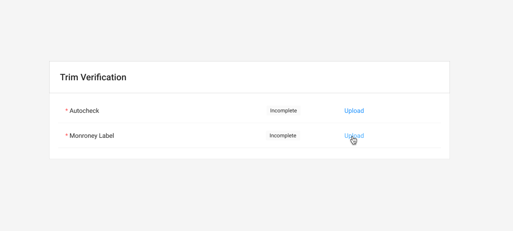
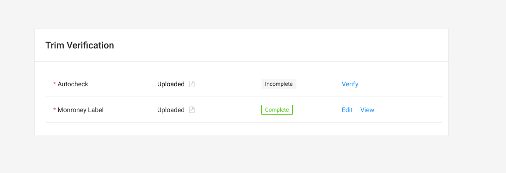

# Trim Table



### Usage

This form is used to manage uploaded documents for Autocheck and Monroney Labels. 

### Primary Component





#### Fields

Fields marked as Required must be completed and validated to submit the form attached to this table.

| Name | Drawer Type |  Required |
| :--- | :--- | :--- |
| Autocheck | Upload/Verify | Yes |
| Monroney Label | Monroney Label | Yes |

### Interactions

### Monroney Label

* The Verify link opens the [Monroney Label Drawer](../../drawer/drawer-trim.md). Once the trim has been verified, the status should change from Incomplete to Complete
  * It is impossible to "fail" a Monroney

See [Task Table](../../../ingredients/task-tables/task-table.md) for additional interactions.

### Related Components

| Component |
| :--- |
| [Autocheck Side Drawer](../../drawer/verification.md) |
| [Maroney Label Drawer](../../drawer/drawer-trim.md) |



See [Task Table](../../../ingredients/task-tables/task-table.md)



### **States**

### **On Load**

### **Image Uploaded & Needs to be Verified**

### Complete Status




\*\*\*\*



\*\*\*\*

