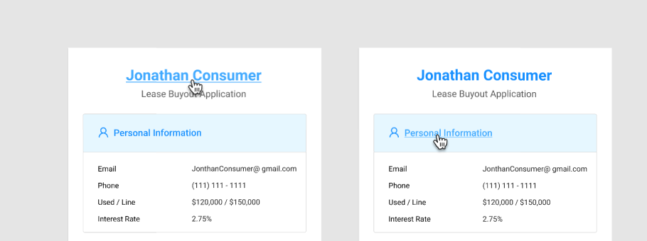

# Right Side Bar

{% embed url="https://www.figma.com/file/w78ZiMR2USgl1CwXVrcxXv/?node-id=2609%3A21222" %}



### Usage



### Requirements

### Data Mappings

#### Personal Information

| Field | Source |
| :--- | :--- |
| Email | Member Input |
| Phone | Member Input |
| Used/Line |  |
| Interest Rate |  |

#### Asset Name

| Field | Source |
| :--- | :--- |
| 2019 Chevrolete Cayoner | Member Input |
| Mileage | Member Input |
| Current Valuation |  |
| Remaining Payment |  |

#### Transaction

| Field | Source |
| :--- | :--- |
| Residual Amount |  |
| Maximum Allowed |  |
| Advance Amount |  |
| Transaction Total |  |
| Minimum Down Payment |  |

#### Valuation

| Field | Source |
| :--- | :--- |
| Preliminary Valuation |  |
| Final Valuation |  |

### Fee Total

| Field | Source |
| :--- | :--- |
| Estimated |  |
| Final |  |

### Lessor

| Field | Source |
| :--- | :--- |
| Lease Account \# |  |
| Type |  |
| Phone |  |
| Address |  |



* Jonathan Customer name is a link to the member's profile page
* Personal information is a link to the member's profile page




### States

### On-Load

{% embed url="https://www.figma.com/file/w78ZiMR2USgl1CwXVrcxXv/?node-id=2628%3A23288" %}

### Trim

{% embed url="https://www.figma.com/file/w78ZiMR2USgl1CwXVrcxXv/?node-id=2628%3A29148" %}

### Preliminary Statement

{% embed url="https://www.figma.com/file/w78ZiMR2USgl1CwXVrcxXv/?node-id=2628%3A24460" %}

### Documents

### Final Statment

{% embed url="https://www.figma.com/file/w78ZiMR2USgl1CwXVrcxXv/?node-id=2628%3A26804" %}

### Disbursement

{% embed url="https://www.figma.com/file/w78ZiMR2USgl1CwXVrcxXv/Axle-Components?node-id=2628%3A27977" %}







