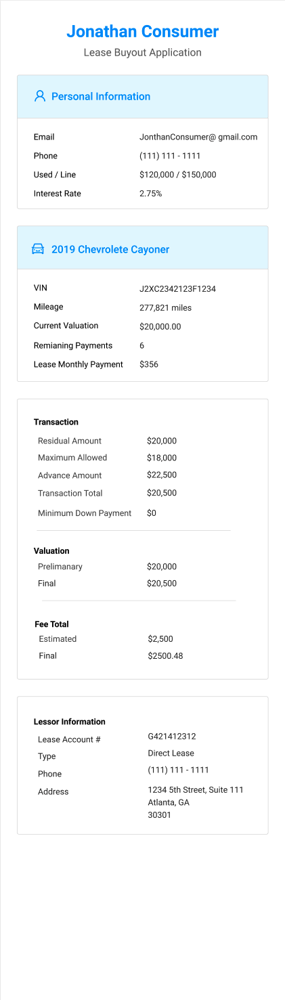
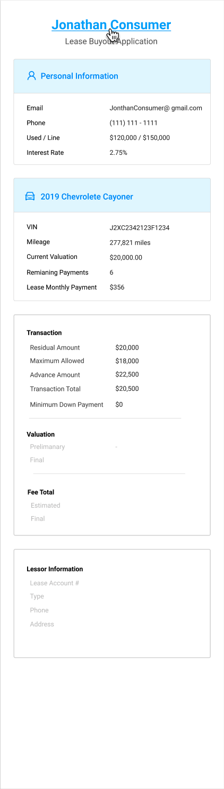
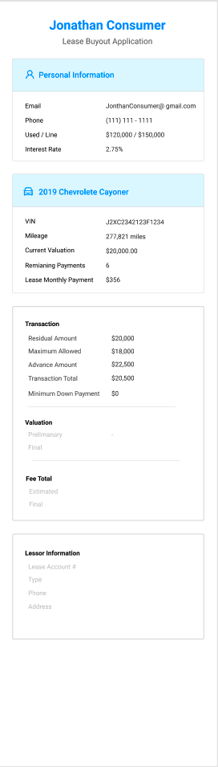
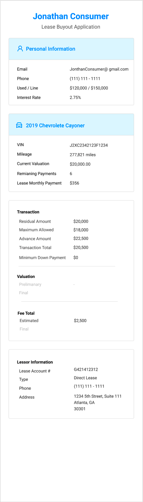
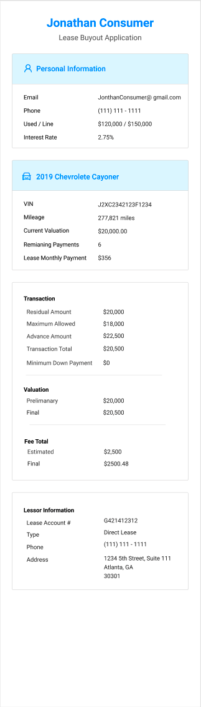

# Right Side Bar



### Usage

The Right Side Bar shows summary information about a transaction.

### Components with Interactions:

| Page |
| :--- |
| [Monroney Label Drawer](../recipe/drawer/drawer-trim.md) |
| [Preliminary Statement](../recipe/form-receipe/statement-input-form-templates/lbo-preliminary-statement.md) |
| [Final Statement](../recipe/form-receipe/statement-input-form-templates/lbo-final-statement.md) |



### Requirements

* The Right Side Bar must be updated whenever values are saved or calculations are performed as a part of the transaction.
  * This happens when the Prelim form is saved, when the Final form is saved, when the Trim is verified via the Monroney Label Drawer, and when the Odometer is verified in the Odometer drawer.

### Interactions

* Clicking the name of the member should bring the user to the member's Member page.
* Clicking Personal Information should bring the user to the member's Member page.

### Steps:

1. Verify the Trim of a vehicle, and note that the prelim valuation is updated.
2. Fill out and save the Preliminary Statement form, and note that the values entered \(and their calculations\) are displayed correctly in the side bar.
3. Verify the Odometer Image of a vehicle, and note that the final valuation is updated.
4. Fill out and save the Final Statement form, and note that the values entered \(and their calculations\) are displayed correctly in the side bar.

### Data Mappings

#### Personal Information

| Field | Source |
| :--- | :--- |
| Email | Member Input |
| Phone | Member Input |
| Used/Line | Borrower Credit Line |
| Interest Rate | Borrower Credit Line |

#### Asset Name

| Field | Source |
| :--- | :--- |
| Year Make Model | Carputty Database |
| Mileage | Member Input, Odometer Verification Drawer |
| Current Valuation | Calculated by Monroney Drawer and Odometer Verification Drawer |
| Remaining Payment | Member Input |

#### Transaction

| Field | Source |
| :--- | :--- |
| Residual Amount | Member Input, Final Statement Form |
| [Maximum Allowed](../overview/calculations.md) | Calculated |
| [Advance Amount](../overview/calculations.md) | Calculated |
| [Transaction Total](../overview/calculations.md) | Calculated |
| Minimum Down Payment | Calculated |

#### Valuation

| Field | Source |
| :--- | :--- |
| Preliminary Valuation | Monroney Label Drawer |
| Final Valuation | Odometer Verification Drawer |

### Fee Total

| Field | Source |
| :--- | :--- |
| Estimated | Preliminary Statement Form |
| Final | Final Statement Form |

### Lessor

| Field | Source |
| :--- | :--- |
| Lease Account \# | Member Input |
| Type | Preliminary Statement Form |
| Phone | Preliminary Statement Form |
| Address | Preliminary Statement Form |



* This sidebar does not show errors, however, the calculations should match the values we have documented, this must be verified in QA.



### States

### On-Load

### Trim

### Preliminary Statement

### Final Statement








